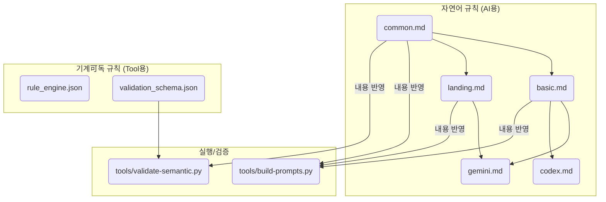
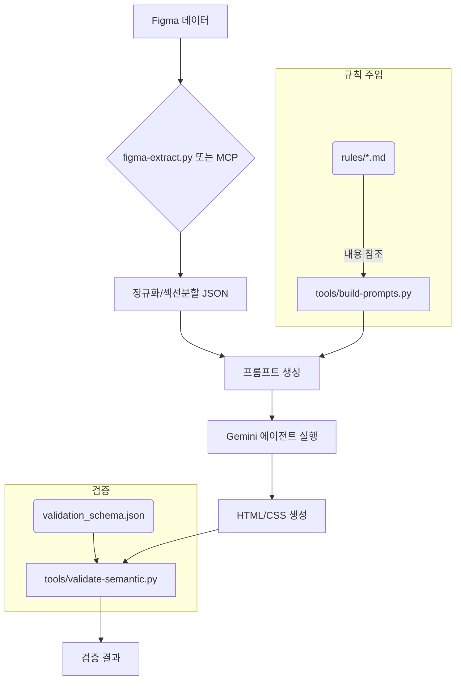

# Gemini 탐색 보고서: `rules` 아키텍처 분석

## 탐색 범위

**핵심 탐색 대상**: `/mnt/d/dev-base/rules/` 디렉토리 전체

**참조된 파일**:
- **규칙**: `common.md`, `basic.md`, `landing.md`, `gemini.md`, `codex.md`, `rule_engine.json`, `validation_schema.json`, `css-enhancement.md`, `enhancement-flow.md`, `ai-pipeline.md`, `semantic-transform-rules.md`, `publishing-workflow-guide.md`
- **프로세스**: `CLAUDE.md` (상위 워크플로우 정의)
- **도구**: `tools/validate-semantic.py`, `tools/figma-extract.py`, `tools/build-prompts.py`, `tools/init-project.py`, `tools/compare-css.py`

## 발견 사항: 아키텍처/흐름 이슈

1.  **규칙의 SSOT(Single Source of Truth) 부재**: 동일한 규칙이 여러 형식과 파일에 걸쳐 중복 선언되어 있습니다.
    - **근거**:
        - **자연어 규칙**: `common.md`, `basic.md`, `gemini.md` 등에 분산. (예: "CSS Grid 사용 금지")
        - **실행 가능한 규칙 (코드)**: `tools/validate-semantic.py` 내 `check_css_grid` 함수에 하드코딩.
        - **스키마**: `validation_schema.json`에 `no_css_grid` 체크 항목으로 존재.
    - **영향**: 규칙 변경 시 여러 파일을 동기화해야 하므로 유지보수 비용이 높고 불일치 위험이 존재합니다.

2.  **프로세스와 규칙의 결합**: `tools/build-prompts.py` 스크립트 내부에 `basic`, `landing` 프로필별 규칙이 하드코딩되어 있습니다.
    - **근거**: `tools/build-prompts.py` 파일의 `PROFILE_RULES` 딕셔너리.
    - **영향**: 프롬프트 템플릿 로직이 규칙의 변경에 취약해집니다. `.md` 파일이 변경되어도 `build-prompts.py`를 수정하지 않으면 실제 프롬프트에는 반영되지 않습니다.

3.  **에이전트별 규칙의 과도한 중복**: `gemini.md`와 `codex.md`는 새로운 규칙보다 `common.md`의 내용을 각 에이전트의 역할에 맞게 재해석하고 강조하는 데 초점이 맞춰져 있습니다.
    - **근거**: `gemini.md`와 `codex.md` 파일 내용을 비교하면 CSS 포맷, 네이밍, 레이아웃 등 핵심 규칙 대부분이 `common.md`에서 파생되었습니다.
    - **영향**: 중복으로 인해 핵심 규칙 전파 및 수정이 번거롭습니다.

4.  **두 가지 Figma 추출 워크플로우 공존**: `CLAUDE.md`는 최신 'Figma MCP 직접 해석' 워크플로우를 강조하지만, `figma-extract.py`와 `compare-css.py` 같은 구(舊) 워크플로우 도구들이 여전히 존재하며 일부 검증용으로 언급됩니다.
    - **근거**: `CLAUDE.md`의 "피그마 MCP 기반 워크플로우" 섹션과 "정밀 값 대조 검증 (선택)" 섹션.
    - **영향**: 워크플로우의 복잡성을 증가시키고 어떤 도구를 주력으로 사용해야 하는지에 대한 혼선을 유발할 수 있습니다.

## 구조적 관계

### 규칙 파일 의존 그래프

- **상속 관계**: `common.md`가 최상위이며, `basic.md`와 `landing.md`가 이를 상속 및 확장합니다. `gemini.md` 등은 이들을 다시 조합/해석합니다.
- **비공식적 의존**: 자연어 규칙(.md)과 기계 가독 규칙(.json, .py) 사이에는 공식적인 `import` 관계가 없으며, 개발자가 수동으로 동기화해야 하는 "내용 반영" 관계만 존재합니다.

### 파이프라인 주입 지점 흐름

- **주입 지점**: `tools/build-prompts.py`가 `.md` 규칙을 참조하여 프롬프트에 주입하는 단계가 핵심입니다.
- **검증 지점**: `tools/validate-semantic.py`가 `validation_schema.json`을 기반으로 생성된 산출물을 검증합니다.

## 미탐색 영역

- `rules/templates/` 디렉토리의 구체적인 템플릿 파일들이 실제 `init-project.py` 외 다른 프로세스에서 어떻게 활용되는지에 대한 깊은 분석은 수행되지 않았습니다.
- 각 Python 도구의 모든 코드 경로를 분석하지는 않았으며, 주로 파일 I/O와 핵심 로직 위주로 파악했습니다.

## 후속 탐색 제안: SSOT화/자동화 리팩터링 TOP 3

1.  **규칙 SSOT(단일 진실 공급원) 확립**:
    - **제안**: 모든 규칙을 하나의 구조화된 파일(예: `rules.yaml`)로 통합합니다. 이 파일에 규칙 ID, 설명(자연어), 파라미터, 검증 로직(정규식 등)을 모두 정의합니다.
    - **기대효과**: 규칙의 중앙 관리, 유지보수 용이성 증대, 불일치 문제 원천 차단.

2.  **규칙 파일 및 스키마 자동 생성**:
    - **제안**: `rules.yaml`을 입력으로 받아 `common.md`, `basic.md` 등의 자연어 규칙 파일과 `validation_schema.json`을 자동으로 생성하는 스크립트(`build-rules.py`)를 개발합니다.
    - **기대효과**: SSOT 변경 시 모든 파생 산출물이 자동으로 업데이트되어 일관성을 보장합니다.

3.  **데이터 기반 검증기(Validator)로 리팩터링**:
    - **제안**: `validate-semantic.py`의 하드코딩된 `check_*` 함수들을 제거하고, `validation_schema.json`에 정의된 검증 타입을 동적으로 해석하여 실행하는 범용 검증 엔진으로 변경합니다.
    - **기대효과**: 새 규칙 추가 시 `rules.yaml`에 정의만 하면 검증 로직이 자동으로 확장되어, 파이썬 코드 수정이 불필요해집니다.
